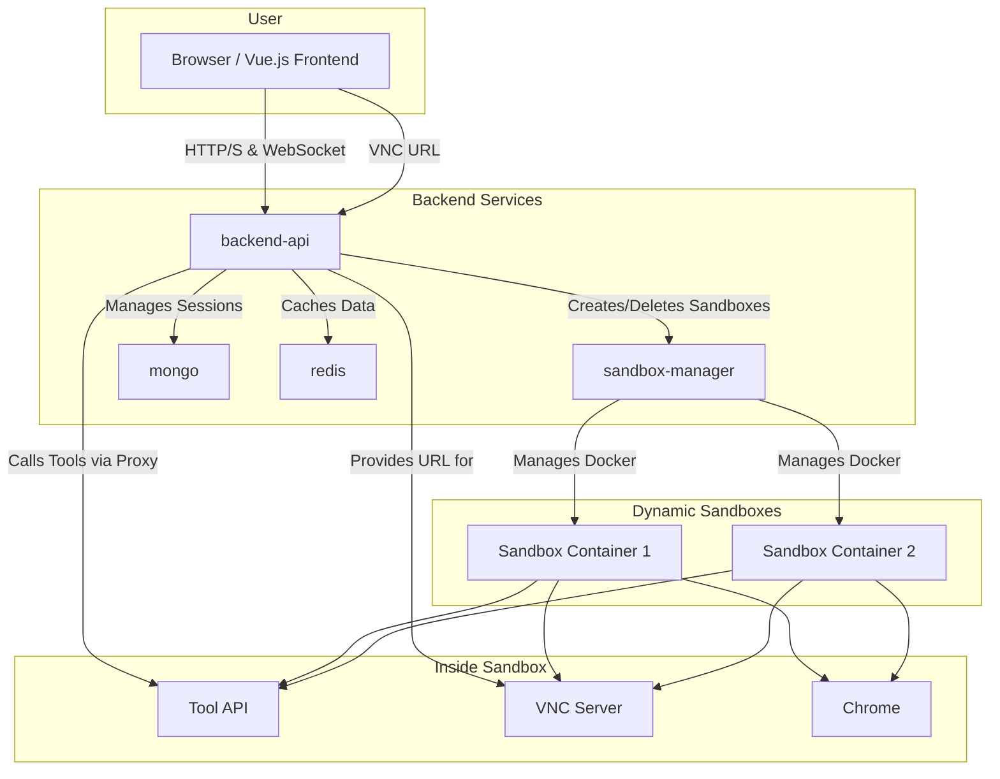

# Intelligent Conversation Agent System

<p align="center">
  
</p>

This project is a comprehensive, multi-service intelligent conversation agent system. It features a FastAPI backend using Domain-Driven Design (DDD), a Vue 3 frontend, and an isolated Docker-based sandbox environment for secure tool execution.

The system is designed to be extensible, allowing for the addition of new tools and AI models with minimal changes.

## Architecture

The system is composed of several independent services orchestrated by `docker-compose`. The `backend-api` in particular follows a clean, Domain-Driven Design structure.

- **`frontend`**: A Vue 3 application that provides the user interface.
- **`backend-api`**: The main API gateway.
  - **`interfaces`**: Defines the API endpoints (FastAPI) and data schemas.
  - **`application`**: Contains the application services that orchestrate the business logic (e.g., `AgentService`).
  - **`domain`**: The core of the application.
    - **`models`**: Defines the core business objects (e.g., `Session`, `Agent`).
    - **`repositories`**: Defines the interfaces for data persistence (e.g., `SessionRepository`).
    - **`services`**: Contains the core domain logic (`AgentDomainService`).
    - **`external`**: Defines interfaces for external services (`LLM`, `Sandbox`).
  - **`infrastructure`**: Contains the concrete implementations of the repositories (e.g., `MongoSessionRepository`).
- **`sandbox-manager`**: A service that manages the lifecycle of sandboxes.
- **`sandbox-image`**: A custom Docker image for the sandbox environment.
- **`tool-api`**: An API service that runs inside every sandbox.
- **`mongo` & `redis`**: Databases for persistence and caching.

### Architecture Diagram (Mermaid)



## Features

- **Multi-service Architecture**: Clean separation of concerns between services.
- **Domain-Driven Design**: The backend is structured with clear boundaries between layers.
- **Isolated Sandboxes**: Secure tool execution in ephemeral Docker containers.
- **Pluggable LLM Providers**: Easily switch between OpenRouter, OpenAI, and other providers.
- **Real-time Interaction**: Server-Sent Events (SSE) for streaming agent thoughts and actions.
- **Extensible Tooling**: A dedicated API within each sandbox and a Model Context Protocol (MCP) configuration.
- **Secure by Design**: JWT authentication and sandboxed file system access.

## Quickstart

### Prerequisites

- Docker and Docker Compose
- An API key from [OpenRouter](https://openrouter.ai/keys) or [OpenAI](https://platform.openai.com/signup).

### 1. Configure Environment Variables

Create a `.env` file in the root of the project by copying the example file:

```bash
cp .env.example .env
```

Now, edit the `.env` file with your configuration. At a minimum, you need to set your `OPENROUTER_API_KEY`.

### 2. Build and Run the System Locally

This project includes several utility scripts to simplify common tasks:

- **`run.sh`**: A smart wrapper around `docker compose` / `docker-compose`.
- **`build.sh`**: Builds all the service images.
- **`dev.sh`**: Starts the system in development mode with hot-reloading.
- **`update.sh`**: Pulls the latest base images for the services.

To build and run the system for production, use:

```bash
# Build the images
./build.sh

# Start the services
./run.sh up -d
```

To run in development mode:
```bash
./dev.sh
```

### 3. Access the Application

- **Frontend**: Open your browser and navigate to `http://localhost:5173`.
- **Backend API Docs**: The OpenAPI documentation for the backend is available at `http://localhost:8000/docs`.

### 4. Shutting Down

To stop all the services and remove the containers, run:

```bash
./run.sh down
```

## Deployment on Railway

This project is configured for deployment on [Railway](https://railway.app/) via a single, root-level `railway.json` file.

This file defines all the services (`frontend`, `backend`, `sandbox`) in the monorepo, specifying their build and start commands. This is the recommended approach for deploying multi-service projects on Railway and solves the "No start command was found" error.

When deploying this repository to Railway, the platform will read the root `railway.json` and configure the services accordingly. You will still need to create `mongo` and `redis` database services as add-ons within your Railway project and link the necessary environment variables to the `backend` service.

**Note on the Sandbox**: The `backend` service needs to create new Docker containers for the sandboxes. This "Docker-in-Docker" functionality may require a special setup or a dedicated plan on the Railway platform.
