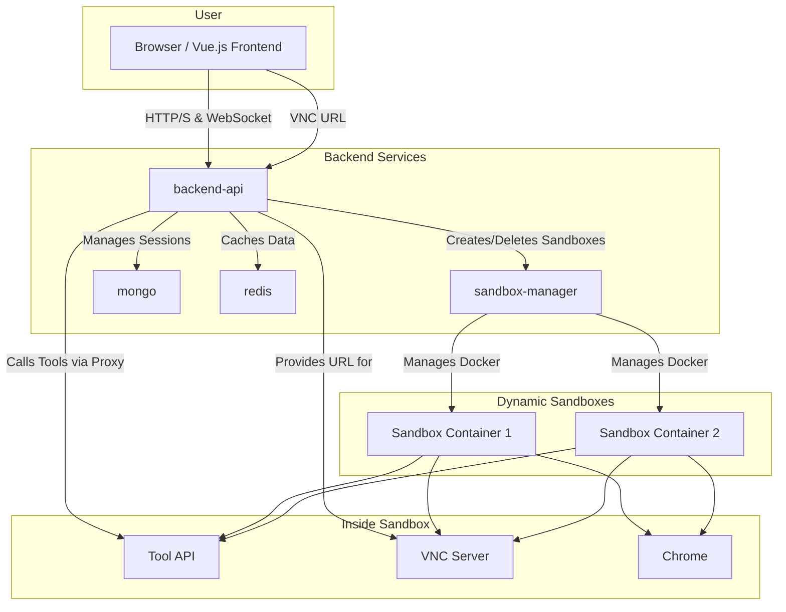

# Intelligent Conversation Agent System

  

This project is a comprehensive, multi-service intelligent conversation agent system. It features a FastAPI backend using Domain-Driven Design (DDD), a Vue 3 frontend, and an isolated Docker-based sandbox environment for secure tool execution.

The system is designed to be extensible, allowing for the addition of new tools and AI models with minimal changes.

## Architecture

The system is composed of several independent services orchestrated by `docker-compose`. The `backend-api` in particular follows a clean, Domain-Driven Design structure.

- **`frontend`**: A Vue 3 application that provides the user interface.
- **`backend-api`**: The main API gateway.
  - **`interfaces`**: Defines the API endpoints (FastAPI) and data schemas.
  - **`application`**: Contains the application services that orchestrate the business logic (e.g., `AgentService`).
  - **`domain`**: The core of the application.
    - **`models`**: Defines the core business objects (e.g., `Session`, `Agent`).
    - **`repositories`**: Defines the interfaces for data persistence (e.g., `SessionRepository`).
    - **`services`**: Contains the core domain logic (`AgentDomainService`).
    - **`external`**: Defines interfaces for external services (`LLM`, `Sandbox`).
  - **`infrastructure`**: Contains the concrete implementations of the repositories (e.g., `MongoSessionRepository`).
- **`sandbox-manager`**: A service that manages the lifecycle of sandboxes.
- **`sandbox-image`**: A custom Docker image for the sandbox environment.
- **`tool-api`**: An API service that runs inside every sandbox.
- **`mongo` & `redis`**: Databases for persistence and caching.

### Architecture Diagram (Mermaid)

## Features

- **Multi-service Architecture**: Clean separation of concerns between services.
- **Domain-Driven Design**: The backend is structured with clear boundaries between layers.
- **Isolated Sandboxes**: Secure tool execution in ephemeral Docker containers.
- **Pluggable LLM Providers**: Easily switch between OpenRouter, OpenAI, and other providers.
- **Real-time Interaction**: Server-Sent Events (SSE) for streaming agent thoughts and actions.
- **Extensible Tooling**: A dedicated API within each sandbox and a Model Context Protocol (MCP) configuration.
- **Secure by Design**: JWT authentication and sandboxed file system access.

## Quickstart

(Quickstart instructions remain the same)
...
