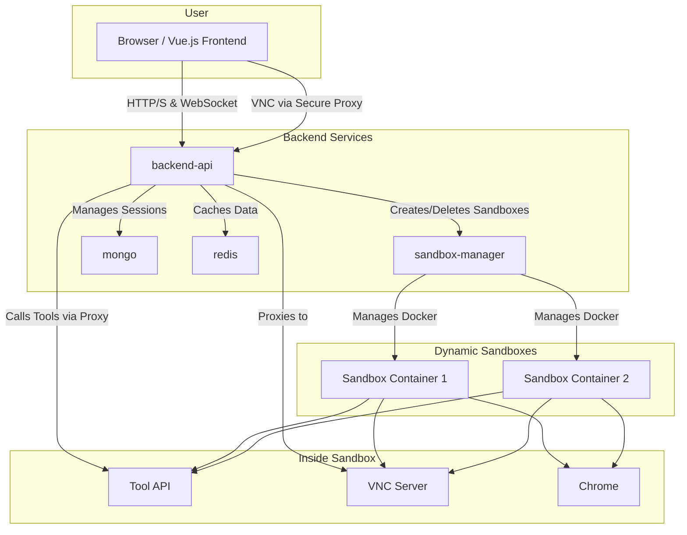

# Intelligent Conversation Agent System

This project is a comprehensive, multi-service intelligent conversation agent system. It features a FastAPI backend using Domain-Driven Design (DDD), a Vue 3 frontend, and an isolated Docker-based sandbox environment for secure tool execution.

The system is designed to be extensible, allowing for the addition of new tools and AI models with minimal changes.

## Architecture

The system is composed of several independent services orchestrated by `docker-compose`:

- **`frontend`**: A Vue 3 application that provides the user interface, including a real-time chat window and tool panels for VNC, file browsing, etc.
- **`backend-api`**: The main API gateway built with FastAPI. It handles user authentication, session management, the core agent logic, and proxies requests to other services.
- **`sandbox-manager`**: A service that manages the lifecycle of sandboxes. It has an API to create and delete isolated Docker containers for each user session.
- **`sandbox-image`**: A custom Docker image that serves as the execution environment for tools. It's based on Ubuntu and includes a VNC server, Chrome browser, and a "Tool API".
- **`tool-api`**: An API service that runs inside every sandbox container, exposing tools like a file manager, a shell, and a web search function.
- **`mongo` & `redis`**: Databases for persistent session storage and caching.

### Architecture Diagram (Mermaid)



## Features

- **Multi-service Architecture**: Clean separation of concerns between services.
- **Isolated Sandboxes**: Secure tool execution in ephemeral Docker containers.
- **Pluggable LLM Providers**: Easily switch between OpenRouter, OpenAI, and other providers via configuration.
- **Real-time Interaction**: Server-Sent Events (SSE) for streaming agent thoughts and actions, and a WebSocket proxy for live VNC interaction.
- **Extensible Tooling**: A dedicated API within each sandbox allows for easy addition of new tools.
- **Secure by Design**: JWT authentication, VNC access tickets, and sandboxed file system access.

## Quickstart

### Prerequisites

- Docker and Docker Compose
- An API key from [OpenRouter](https://openrouter.ai/keys) or [OpenAI](https://platform.openai.com/signup).

### 1. Configure Environment Variables

Create a `.env` file in the root of the project by copying the example file:

```bash
cp .env.example .env
```

Now, edit the `.env` file with your configuration. At a minimum, you need to set your `OPENROUTER_API_KEY`.

```
# .env

# --- LLM Configuration ---
# Set the provider to "openrouter" or "openai"
LLM_PROVIDER=openrouter

# Set the model ID to use.
# For OpenRouter, find models at https://openrouter.ai/models
# A good free model to start with is "anthropic/claude-3-sonnet:free"
MODEL_ID=anthropic/claude-3-sonnet:free

# --- API Keys ---
# Get your API key from https://openrouter.ai/keys
OPENROUTER_API_KEY=your_openrouter_api_key

# Or, if using OpenAI directly:
OPENAI_API_KEY=your_openai_api_key
```

### 2. Build and Run the System

With Docker running, execute the following command from the project root:

```bash
sudo docker compose up --build -d
```

This will:
- Build the Docker images for the `frontend`, `backend-api`, and `sandbox-manager`.
- The `sandbox-manager` will automatically build the `sandbox-image` on its first run.
- Start all the services in detached mode.

### 3. Access the Application

- **Frontend**: Open your browser and navigate to `http://localhost:5173`.
- **Backend API Docs**: The OpenAPI documentation for the backend is available at `http://localhost:8000/docs`.

### 4. Shutting Down

To stop all the services and remove the containers, run:

```bash
sudo docker compose down
```
